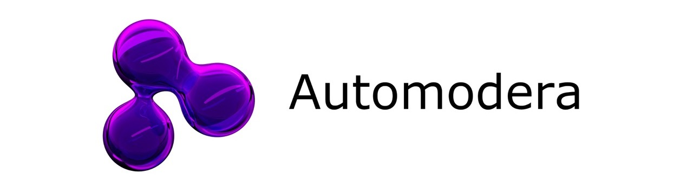

The open moderation toolkit making the internet a safer place for everyone.

A Publish-Subscribe Network for Distributing Perceptual Hashes of Images, written in Java.

See automodera.com for more information and usage instructions.

PRs open. 

## License and 3rd Party Software
This project uses 3rd party libraries. View the automatically generated FOSSA report here: [3rd Party Software Report](https://app.fossa.com/reports/59e67f12-02d5-45e9-b78d-440f2614e0f0).
Automodera is available under GNU General Public License v3.0.
